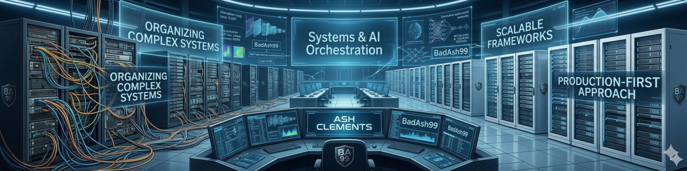

<div align="center">



<br/>

# Ash Clements `// BadAsh99`

**Sr. SASE & AI Security Consultant — Palo Alto Networks**

[](https://www.linkedin.com/in/ash-clements-75b62b22/)
[](https://badash99.github.io)
[](https://github.com/BadAsh99)

</div>

---

```
> Initializing BadAsh Security Lab...
> Mapping LLM attack chains         [DONE]
> Scanning cloud posture             [DONE]
> Validating PAN-OS config          [DONE]
> Deploying Prisma AIRS enforcement  [ACTIVE]
```

---

## What I Build

Prisma AIRS gives you the enforcement plane. My lab work lives one layer beneath it — mapping the attack chains, prompt injection vectors, and AI red team scenarios that AIRS is architected to stop. If you want to understand why the product works, build the thing it's defending against.

**PSC by day. Red teamer by night.**

---

## Featured Projects

| Project | What It Does | Stack |
|---------|-------------|-------|
| **[badash-killchain](https://github.com/BadAsh99/badash-killchain)** | LLM attack chain mapping, prompt injection, AI red team — AIRS-aligned | Python · Docker · FastAPI |
| **[LLMGuardT2](https://github.com/BadAsh99/llmguardt2)** | OWASP LLM Top 10 scanner with semantic detection — catches paraphrased attacks | Flask · sentence-transformers · GCP |
| **[CloudGuard](https://github.com/BadAsh99/cloudguard)** | Read-only cloud misconfiguration scanner — CIS Benchmarks + Terraform remediation | Python · Azure SDK · Docker |
| **[Firewise AI](https://github.com/BadAsh99/firewise-ai)** | PAN-OS config auditor via natural language — upload XML, ask questions | Streamlit · Gemini · GPT-4 |

---

## Stack

**Security**


**AI / ML**


**Infrastructure**


**Languages**


---

## #BadAshWednesdays

Every Wednesday — tracking the pivot from manual SASE to agentic AI security workflows. No thought leadership fluff. Just what got built, what broke, and what it means for enterprise AI security at scale.

[](https://badash99.github.io/badashwednesdays/)

> *"Blocking LLMs at the perimeter and calling it AI governance is the security equivalent of a 'No Trespassing' sign on a glass door."*

**[→ Full series on LinkedIn](https://www.linkedin.com/in/ash-clements-75b62b22/)**
**[→ All posts on the lab site](https://badash99.github.io/badashwednesdays/)**

---

## GitHub Stats

<div align="center">


</div>

---

<div align="center">

**[badash99.github.io](https://badash99.github.io)** · Built with Claude Code · `#BadAshWednesdays`

</div>
